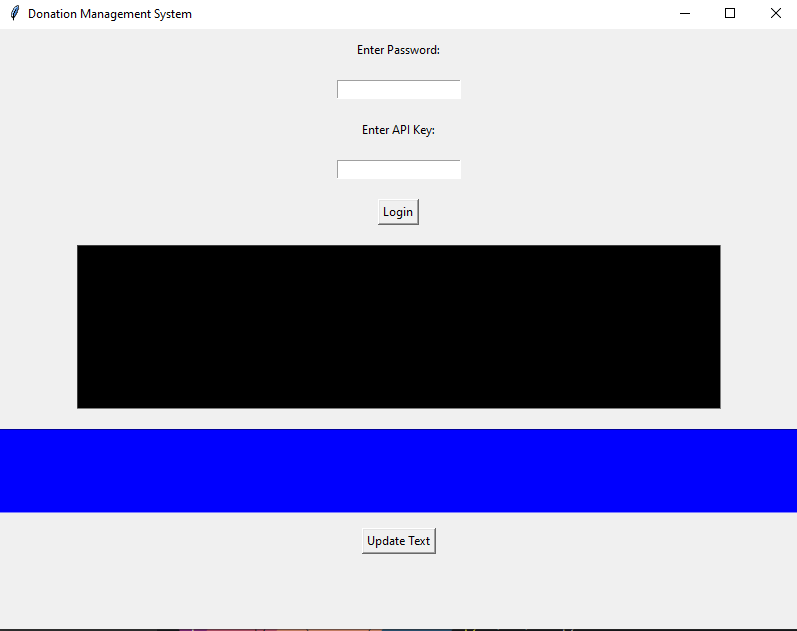
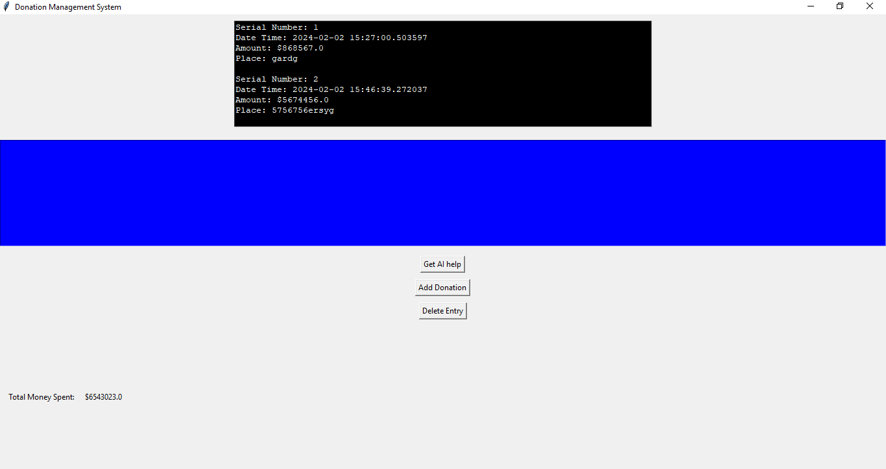
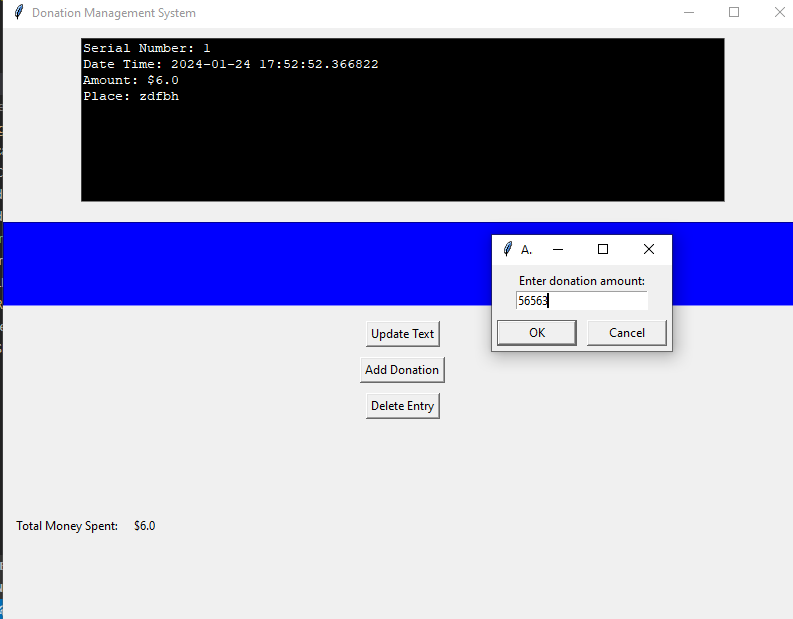
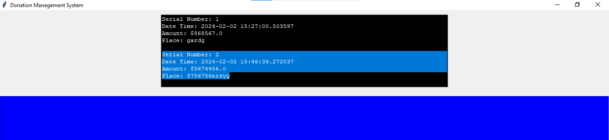
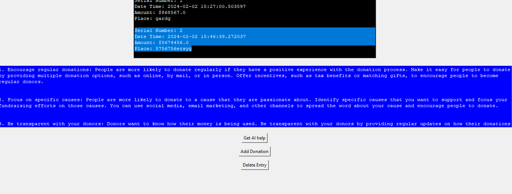

## Donation Management System with AI recommendations
<div align="center">

</div>

  A simple donation management system written in python with AI recommendation. 
<hr>

This is a simple donation management system implemented in Python with AI recommendations Scheduling with distribution recommendations also .


 - Includes password for verification
 - With ai recommendation system 
 - With easy to use and minimal UI
 - Free and Open Source software
 - Built for people not for money ♥

 # STAR this to show your support ♥

# Demo Images





# How to install 
clone this repository
```
git clone https://github.com/rudransh61/Donor.py.git
```

Then install all dependencies using this command
```
pip install requirements.txt
```

Also use Python 3.10.9 (it works for me)
or any other suitable version

Then main file of program is in `src` folder `main.py`.

# How to use it
Run the file by using the command
```bash
cd ./src #to change the directory
py main.py #to run the program
```
There is some test data in `donor_list.json` file.

## Use the program

After running it you can see a GUI with an input field,
1) Password : just enter `pass` as it is default

- NOTE:- Before running the program make sure you had pasted your [Google AI studio](https://makersuite.google.com/app/prompts/new_freeform) api key in `.env` file in `src` folder. (otherwise do this and restart the program)
```bash
./src/.env
API_KEY = ******************************* #your key
```

Now press Login button


Now you can see different options available like
 - Get ai HELP
 - Add donation 
 - Delete donation
 - And Total amount spent at the bottom of the screen
 - A blue colored screen with text generated from AI

## Add donation
Click `Add donation`  button , fill all the fields 
You can see the list of on the screen will be updated


## Delete donation
To delete the donation first select the 3 lines of the data which you want to delete


And then click the delete button

## Get AI help
Click get AI help and see the recommendation of AI in the blue terminal text.
(It takes some time <1min)



Demo :-
<video controls width="300">

  <source src="demo.mp4" type="video/mp4" />
</video>